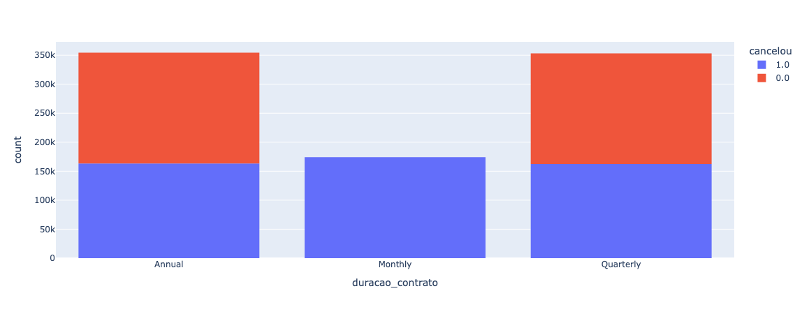
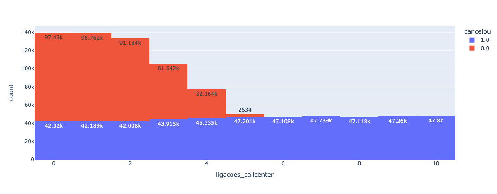
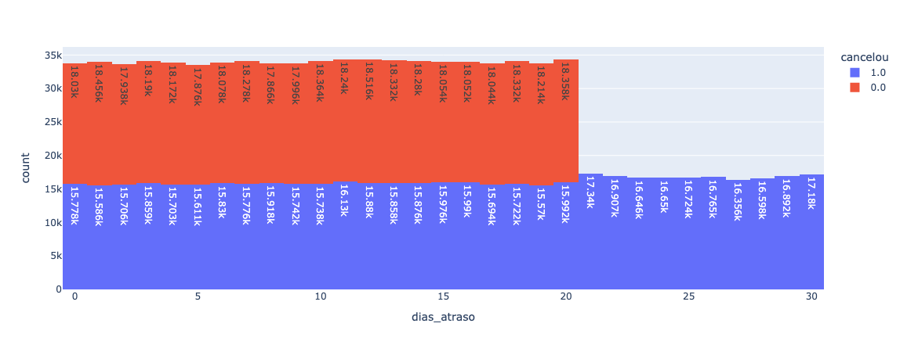

# Projeto de Análise de Cancelamento de Clientes

Esse projeto visa analisar uma base de dados com mais de 800 mil clientes para responder as seguintes perguntas:
1. Qual o percentual de cancelamento desses clientes?
2. Quais os principais motivos que influênciam na taxa de cancelamento?
3. Quais as medidas que podem ser propostas para diminuir essa quantidade de cancelamento?
4. Qual o novo percentual de cancelamento caso as medidas propostas forem realizadas? 

## Funcionalidades

- Realizar uma análise de forma eficiente.
- Obter respostas úteis para a empresa.
- Tornar os dados vísiveis.

## Tecnologias Utilizadas

- [Python 3.12.7](https://www.python.org)

## Bibliotecas Utilizadas

- [Pandas-2.2.3](https://pandas.pydata.org)
- [plotly-5.24.1](https://plotly.com/python/)

## Explicando o projeto

O projeto visa solucionar um problema de alta taxa de cancelamento de uma empresa fictícia e para isso será necessário analisar uma base de dados de canelamento de clientes dessa empresa fictícia para extrair informações que cooperem para a solução desse problema.

Para obter êxito foi necessario dividir primeiramente o desafio em passo:

### Passo 1: Importar a base de dados

Para realizar esse passo foi necessário primeiramente fazer a imortação da biblioteca pandas que é uma ferramenta presente no Python que permite a leitura de diversos tipos de arquivos. 
No caso da nossa base de dados se trata de um arquivo .csv que possui **CustomerID**, **idade**, **sexo**, **tempo_como_cliente**, **frequencia_uso**, **ligacoes_callcenter**, **dias_atraso**, **assinatura**, **duracao_contrato**, **total_gasto**, **meses_ultima_interacao**, **cancelou**. 
Esses dados ao serem importados foram atribuídos a uma variável "tabela" para que pudesse serem salvos e acessados posteriormente. 

### Passo 2: Visualizar os dados (entender a base + identificar problemas)

Em seguida, com os dados já importados foi o momento de entender-los e identificar possiveis problemas. Tais problemas poderiam ser a presença de valores vazios, valores que não são úteis para a resolução do caso e/ou valores com o tipo de dado equivocado.

### Passo 3: Descartar os dados que não são úteis para minha resolução

Identificado os problemas que foram: presença de valores vazios e uma coluna com informações não úteis, é o momento resolve-los. 
No caso dos valores vazios por se tratar apenas de uma quantidade insignificante comparada com o todo, essas linhas com valores ausentes foram descartadas. Já a coluna de CustomerID foi removida pois ela não acrescenta nada a análise.

### Passo 4: Analisar os dados depois de limpos e começar o raciocinio 

Com a tabela limpa devemos realizar as perguntas que visam solucionar o caso e buscar as respostas observando os dados.
As perguntas a serem respondidas: 
1. Qual o percentual de cancelamento desses clientes?
2. Quais os principais motivos que influênciam na taxa de cancelamento?
3. Quais as medidas que podem ser propostas para diminuir essa quantidade de cancelamento?
4. Qual o novo percentual de cancelamento caso as medidas propostas forem realizadas? 

### Passo 5: Montar os gráficos para vê o que impacta no cancelamento. 

Com o intuito de auxiliar na análise foi utilizado a biblioteca plotly que possui a ferramenta de transformar os dados em diversos modelos de gráficos, no caso, foi escolhido o histograma para visualizar de forma clara e responder as perguntas. 

## Resultado

Analisando os gráficos foi possivel notar que a taxa de cancelamento está diretamente relacionada com três principais pontos que são: 

* Duração do contrato;

* Número de ligações realizadas para o callcenter;

* Dias de atraso no pagamento. 

Diante disso foi proposto medidas para serem tomadas e reverter esse quadro, foram elas:
* Modificar ou evitar o contrato mensal e incentivar (com desconto) os contratos anuais e trimestrais;
* Criar um processo que quando um usuário já tiver realizado 3 ligações para o call center ascender um alerta vermelho
* Entrar em contato com os clientes que já possuem 15 dias de atraso no pagamento.

>[!IMPORTANT]
>
>Colocando essa medidas em pratica a taxa de cancelamento reduz em cerca de 38% saindo de 56,7% para 18,4%. 

## Licença

Este projeto está licenciado sob a licença MIT. Você é livre para usá-lo, modificá-lo e distribuí-lo, desde que inclua a licença original em todos os arquivos redistribuídos.
